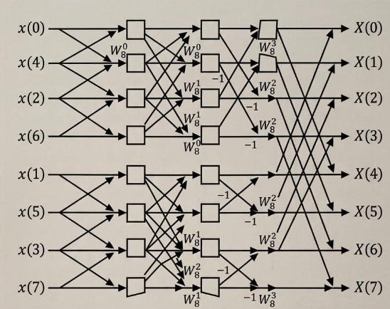
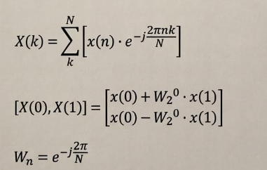
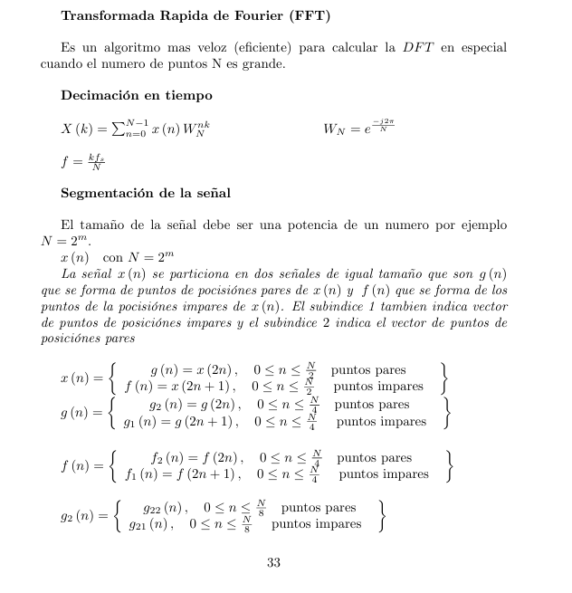
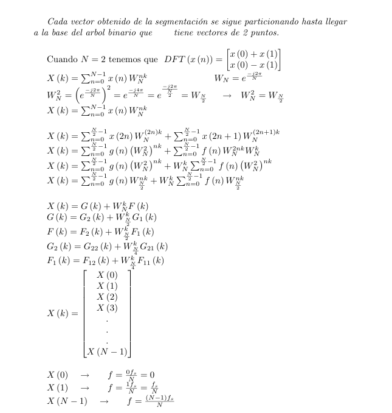
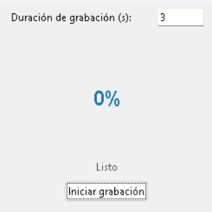
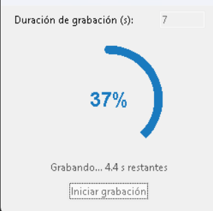
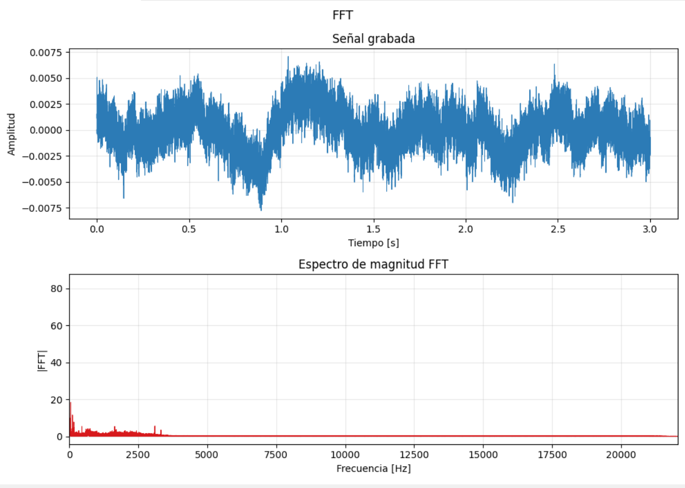

# Estudio e Implementación de la Transformada Rápida de Fourier (FFT) en Señales de Audio

## Resumen
En el presente documento se estudian los fundamentos de las transformadas en el dominio de la frecuencia, con un enfoque particular en la Transformada Rápida de Fourier (FFT). Se detalla una implementación desarrollada en el lenguaje de programación Python, la cual hace uso de las bibliotecas `numpy`, `matplotlib`, `sounddevice` y `tkinter` para capturar una señal de audio en tiempo real, aislar la captura con indicadores de progreso, permitir su reproducción bajo demanda y, finalmente, graficar su representación espectral en el dominio de la frecuencia. Este enfoque práctico permite evidenciar la reducción de complejidad matemática y la utilidad de la FFT en el análisis de componentes frecuenciales sobre señales discretas en el tiempo.

## Palabras Clave
Procesamiento de señales, FFT, Espectro de frecuencias, Analizador de audio.

## Introducción
La Transformada Rápida de Fourier (FFT) es uno de los algoritmos más fundamentales en el procesamiento digital de señales. Su principal propósito es extraer la información del espectro frecuencial de una señal que originalmente se encuentra en el dominio del tiempo o del espacio. Su importancia radica en la reducción drástica de la complejidad computacional: mientras que el algoritmo tradicional de la Transformada Discreta de Fourier (DFT) requiere una complejidad de $O(N^2)$, la FFT optimiza este proceso y lo reduce a $O(N \log N)$. 

Históricamente, aunque Carl Friedrich Gauss ya había planteado principios algorítmicos similares en 1805, el algoritmo que popularizó la FFT fue desarrollado por James Cooley y John Tukey en 1965. Hoy en día, sus implementaciones son el núcleo de tecnologías cotidianas, siendo indispensable para la compresión de audio (como el formato MP3), procesamiento de imágenes, sistemas de radar, filtrado digital de señales y telecomunicaciones (LTE, Wi-Fi).

El mecanismo a grandes rasgos de la FFT opera bajo el paradigma computacional de "divide y vencerás". El acometido de este concepto computacional divide recursivamente la transformada de un arreglo de tamaño $N$ en transformadas de tamaño $N/2$, agrupando subsecuentemente la señal en componentes pares e impares y ahorrando una vasta cantidad de cálculos redundantes.

## Marco Teórico
Matemáticamente, la señal capturada es una versión discreta y acotada de una onda de sonido. Para llevar esta señal al dominio frecuencial, se subdivide el arreglo de la señal original en particiones mínimas. 

A un nivel estructural, las variaciones en este método aplican cálculos similares a la Transformada Discreta del Coseno (DCT) o DFT combinadas sobre las partes más pequeñas del arreglo. Al realizar esta descomposición temporal (como sucede estrictamente en el algoritmo Radix-2), la información se separa, procesando los índices individualmente y luego entrelazándolos usando factores de giro, conocidos tradicionalmente como _twiddle factors_ ($W_N^k = e^{-j 2\pi k / N}$). Esto permite escalar las estructuras atómicas de la señal sumando los resultados parciales hasta conformar la totalidad del espectro sobre toda la banda.

## Metodología
Para la captura del hardware lograda en este desarrollo, se seleccionó el uso de la librería `sounddevice` dado que provee un enlace directo y de muy baja latencia con el framework *PortAudio*, ofreciendo buffers de audio estables e integrándose transparentemente con arreglos de NumPy. Por su parte, se seleccionó `numpy.fft` para el cálculo del dominio en frecuencia debido a que internamente ejecuta bibliotecas precompiladas en C (como PocketFFT) que manejan eficientemente vectores nativos a máxima velocidad.

La abstracción de estos cálculos se puede observar analizando lógicamente la rutina implementada en el sistema, específicamente en el componente `_apply_fft`:

1.  **Configuración de muestras y periodos**: Se calcula $N$ (la cantidad total de muestras) y el periodo de muestreo $T_s = 1 / f_s$.
2.  **Cálculo Computacional de la Serie Compleja**: Se ejecuta la instrucción `nft.fft(signal)` la cual lleva la señal acústica original temporal de los números reales a los números complejos, conformando la fase y componente espectral.
3.  **Módulo Espectral (`np.abs`)**: Debido a que los elementos del arreglo `fft_result` son complejos ($a + bj$), se procede aplicándoles el módulo o magnitud vectorial ($\sqrt{a^2 + b^2}$). Las magnitudes resultantes representan directamente la fuerza o amplitud de cada una de las frecuencias presentes.
4.  **Distribución de Frecuencias**: Mediante el método `.fftfreq()`, el eje de índices resultante se mapea a un vector proporcional en hercios (Hz) de acuerdo al algoritmo de partición temporal de Nyquist.
5.  **Descarte de Simetría (Frecuencias Positivas)**: Para las señales de audio puramente reales, las respuestas de la FFT exhiben una propiedad de simetría conjugada, en la que las frecuencias negativas son redundantes respecto a las positivas. El filtrado realizado se encarga de descartarlas para poder graficar fielmente el espectro del primer armónico hasta el límite funcional de Nyquist (la mitad de la frecuencia de muestreo).

**Interfaz y Captura Gráfica**

El sistema cuenta con una interfaz que implementa un contador circular para otorgar feedback visual del progreso de la grabación al usuario, evitando eventos bloqueantes. 

Una vez en estado de recolección y lectura, el widget avanza asíncronamente:

Una vez la recolección de los periodos de tiempo seleccionados finaliza, el módulo genera las gráficas resultantes tanto en el dominio del tiempo como el dominio en frecuencia. A partir de este momento, se libera además un botón de control en la interfaz ("▶") que permite al usuario reproducir un bypass directamente a la tarjeta de sonido de lo que se escuchó e interpretó para el cálculo, mecanismo de validación que queda eliminado limpiamente de la memoria persistente en el momento en el cual la gráfica elaborada se cierra.

## Referencias
[1] J. W. Cooley y J. W. Tukey, "An algorithm for the machine calculation of complex Fourier series," *Mathematics of Computation*, vol. 19, no. 90, pp. 297-301, 1965.

[2] A. V. Oppenheim y R. W. Schafer, *Discrete-Time Signal Processing*, 3ra ed. Pearson Prentice Hall, 2009.

[3] Documentación oficial de NumPy. "Discrete Fourier Transform (numpy.fft)". *Numpy.org*. Disponible en: https://numpy.org/doc/stable/reference/routines.fft.html

[4] Documentación oficial de Sounddevice. "python-sounddevice". *Python-sounddevice.readthedocs.io*. Disponible en: https://python-sounddevice.readthedocs.io/en/0.4.6/